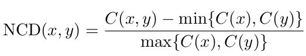
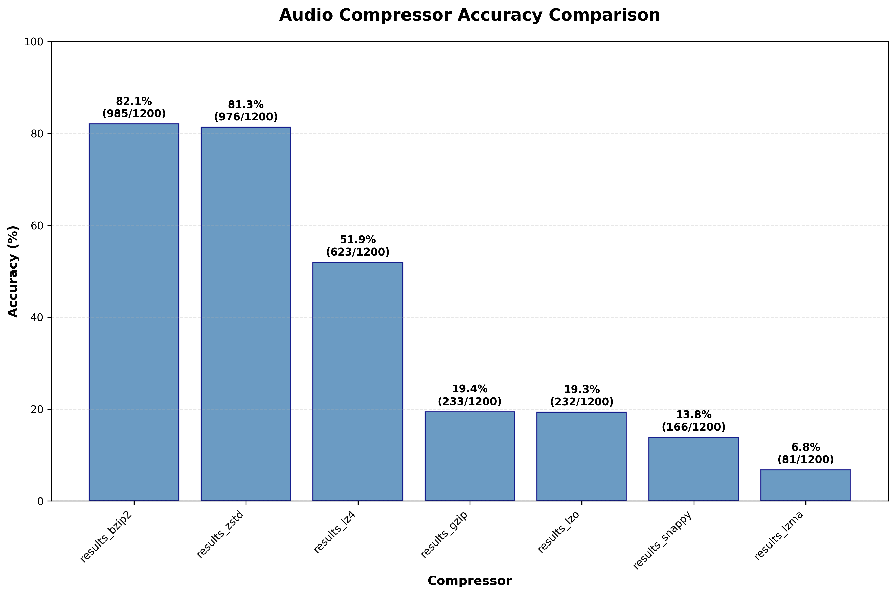
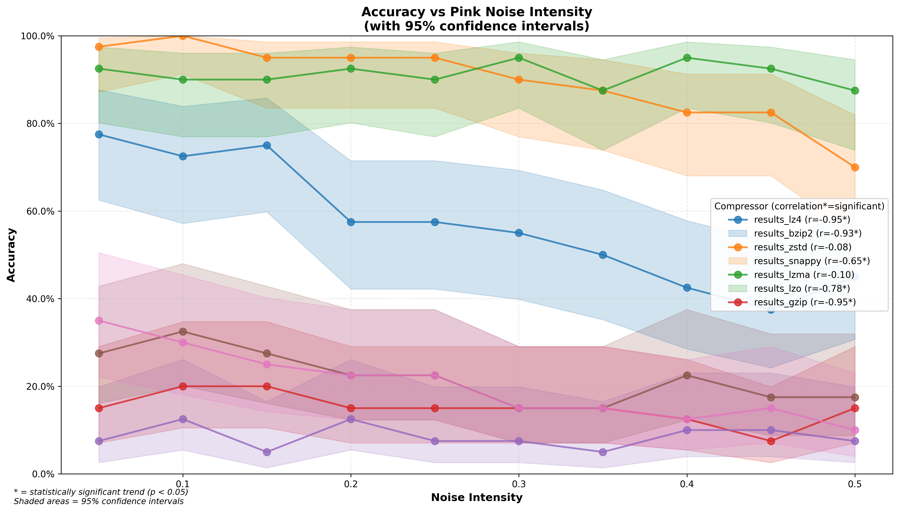
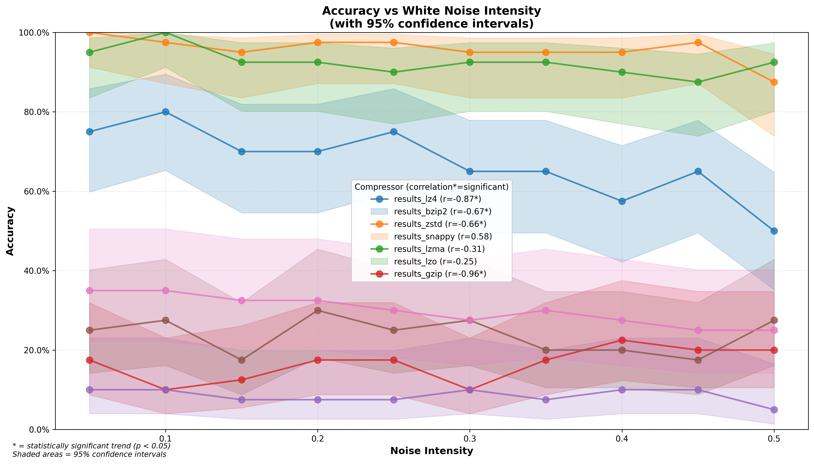
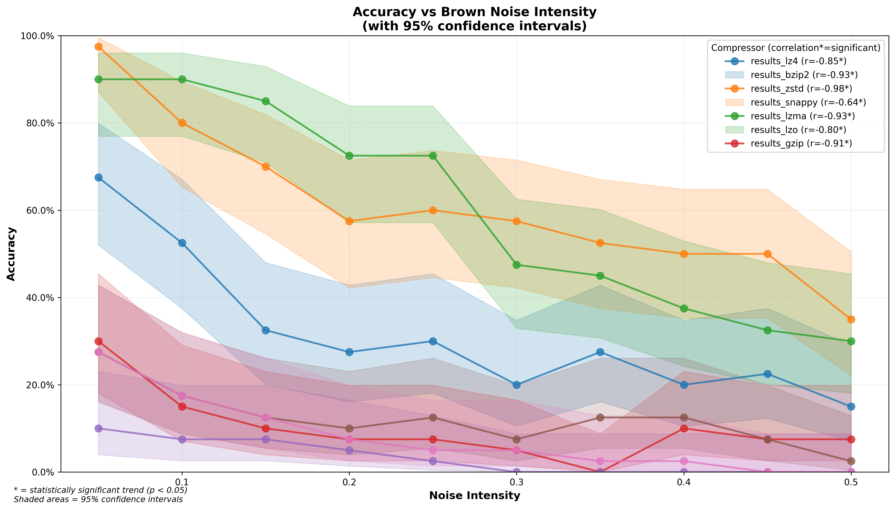
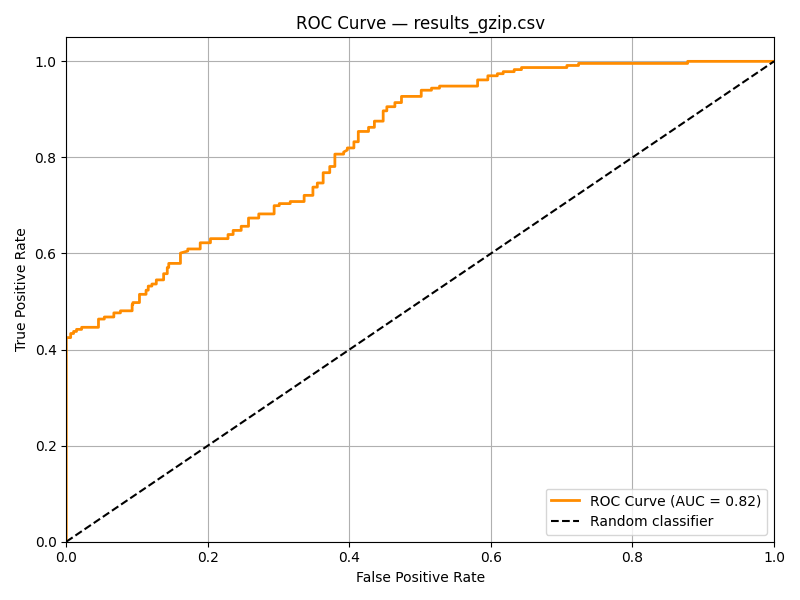
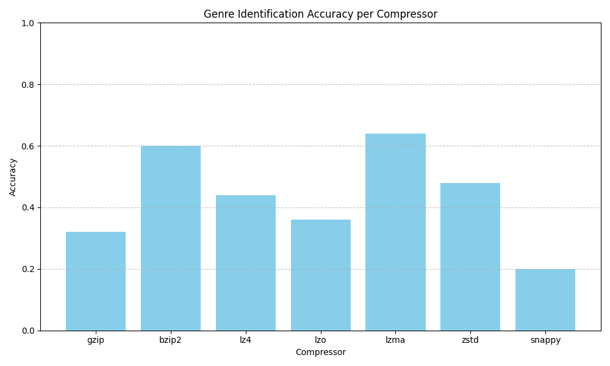

# PROJECT3_TAI

First Year - MEI - 2nd Semester Class (Universidade de Aveiro) - Algorithmic Theory of Information 

| Name              | Nmec   |
|-------------------|--------|
| Diogo Silva       | 107647 |
| Miguel Cruzeiro   | 107660 |
| Miguel Miragaia   | 108317 |

### Overview

This project performs music identification based on Normalized Compression Distance (NCD) using precomputed frequency features from WAV audio files. It compares noisy audio queries to a database of song snippets to identify the most similar matches.

## Get Max Freqs Implementaion

We implemented in Python the frequency extraction function originally provided by the professor, adapting it to handle stereo WAV files with a fixed sampling rate of 44,100 Hz. The function processes the audio by converting it to mono, downsampling it, and applying a sliding window to perform FFT (Fast Fourier Transform) on each segment. From each FFT result, it selects the most energetic frequency components, which are then encoded into a compact signature. These signatures are written to a binary file for further use in the genre classification pipeline.

## Dataset

For this project, we selected 26 songs across diverse musical genres to create a comprehensive dataset for testing. Our selection includes tracks from various styles such as rock, hip-hop, electronic, pop, alternative, and metal, ensuring sufficient genre diversity to evaluate the robustness of our implementation. This varied collection allows us to test whether NCD can effectively distinguish between audio excerpts and accurately identify their source tracks, regardless of musical style or complexity. The dataset serves as a foundation for analyzing how compression-based similarity measures perform in audio pattern recognition tasks.

| Artista | Música |
|---------|--------|
| AC/DC | You Shook Me All Night Long |
| Alice In Chains | Them Bones |
| A$AP Rocky | Sandman |
| Avicii | Wake Me Up |
| Coldplay | Viva La Vida |
| Dio | End Of The Beginning |
| Frank Ocean | White Ferrari |
| Gorillaz | Feel Good Inc. |
| Imagine Dragons | Bones |
| Kanye West | Hurricane |
| Lady Gaga, Bruno Mars | Die With A Smile |
| Mac Miller | 2009 |
| Mark Ronson | Uptown Funk |
| Metro Boomin Don Toliver Future  | Too Many Nights |
| Nirvana | Come As You Are |
| OneRepublic | Counting Stars |
| Playboi Carti | Magnolia |
| Post Malone | White Iverson |
| Radiohead | No Surprises |
| Sabrina Carpenter | Espresso |
| Slipknot | Duality |
| SUR LE PONT D'AVIGNON | Mach-Hommy |
| System of a Down | Chop Suey |
| Taylor Swift | Fortnight (feat. Post Malone) |
| The Weeknd | Timeless with Playboi Carti |
| Travis Scott | NO BYSTANDERS |
| untitjapan | PYRAMIDZ |

## Frequency File

We created a bash script **generate_signatures.sh** that converts the inital audio files in .wav format to .freqs format and stores them in the database folder.

# Test Queries

We created a Python script **batch_segment_audio.py** that automatically splits every audio file in a given folder into a fixed number of segments of equal duration. Each segment can include silence padding if the audio is too short. The script supports common audio formats such as .wav and .mp3 and outputs the segments in .wav format to a specified output folder.

It works as follows:

- For each audio file, it generates a fixed number of segments (num_segments), each with a specified duration (segment_length in seconds).

- The segments are evenly distributed across the audio timeline, with optional padding at the end if the segment extends past the audio duration.

- All output segments are saved with sequential names (e.g., song_segment1.wav, song_segment2.wav, etc.) to the target output directory.


For the process of applying the different type of noise to each segment, we created a bash script **noise_generator.sh** that runs the program **noise_generator.py**

In that program we used SOX, which is  is a powerful command-line utility that allows audio processing tasks such as noise generation and mixing. We focused on adding noise based on intensity levels, where different types of noise (white, pink, and brown) were added to each input audio segment using predefined intensity values. The core function used for this was process_directory_intensity, which iterates through all audio files in the input directory and applies each noise type across a range of intensity values (from 0.05 to 0.50).

For each combination of audio file, noise type, and intensity, the program:

- Retrieves the duration and sample rate of the input audio using soxi.

- Generates a noise file of the same duration and sample rate using sox with the synth command and the specified noise type.

- Mixes the original audio with the generated noise using the sox -m command, scaling the noise volume according to the specified intensity (e.g., -v 0.2 for 20% noise intensity).

- Saves the output in the given output directory with filenames reflecting the original name, noise type, and intensity used.

## Implementation

The developed program provides two main functionalities:

- Music identification from a short audio sample

- Music genre classification

Both functionalities rely on the use of the Normalized Compression Distance (NCD), a similarity metric that estimates the distance between two files based on their compressibility. For each task, the NCD is computed between the input file (query sample) and each file in the database.

To implement these functionalities, the system is composed of the following source files:

- `main.cpp`
- `freq_loader.cpp`
- `ncd.cpp`
- `utils.cpp`

Along with their corresponding header files:

- `freq_loader.hpp`
- `ncd.hpp`
- `utils.hpp`


# Main Program (main.cpp)

The main program provides comprehensive support for both music identification and genre classification using command-line arguments.

## Command-Line Arguments

| Argument | Description |
|----------|-------------|
| `--compressor` | Specifies which compression algorithm to use (e.g., gzip, bzip2, zstd, lzma, lzo, snappy, lz4) |
| `--query` | Defines the search query |
| `--output` | Sets the output destination for results |
| `--genre` | Runs the program in genre classification mode |

## Operating Modes

### Music Identification Mode
- Computes the Normalized Compression Distance (NCD) between a query and all database entries
- Selects the entry with the lowest distance as the match
- Default mode when `--genre` flag is not specified

### Genre Classification Mode
- Activated with the `--genre` flag
- Calculates NCD for each genre using 10-minute audio samples
- Each genre sample consists of concatenated songs from that specific genre

## Core Features

### Database Management
- **File Loading**: Automatically loads frequency files with `.freqs` extension
- **Flat Structure**: Uses simple list for music identification tasks
- **Genre Structure**: Organizes data into genre-separated format using custom `GenreDatabase` struct

### Query Processing
- **Single File**: Processes individual audio files
- **Batch Processing**: Evaluates all files within a specified directory

### Results Output
- **CSV Format**: Generates detailed CSV files for both identification and classification tasks
- **Comprehensive Metrics**: Includes noise type, intensity, NCD values, expected results, and confidence levels
- **Organized Data**: Structured output for easy analysis and comparison

## Dependencies

The program relies on several helper modules:
- **freq_loader**: Handles frequency file loading and parsing
- **ncd**: Implements Normalized Compression Distance calculations(**ncd.cpp**)
- **utils**: Provides utility functions and data structures(**utils.cpp**)
- **GenreDatabase**: Custom struct for organizing genre-specific data

## NCD(**ncd.cpp**)

In this program, the NCD is calculated using the formula:




## Utils(**utils.cpp**)

This program includes implementations for all the compression algorithms used throughout the project, which are:

- **GZIP**
- **BZIP2**
- **Zstandard (ZSTD)**
- **LZMA**
- **LZO**
- **Snappy**
- **LZ4**

These compressors are used to compute the compressed sizes required for NCD calculation, enabling a comparative analysis of their effectiveness in music and genre identification tasks.

# Results

## Music Identification
The goal of the music identification task is to recognize which song in the database most closely matches a given audio query, typically a short noisy excerpt. The system relies on the Normalized Compression Distance (NCD) to quantify similarity between audio files that have been converted into frequency-based representations.

### How It Works

1. Audio files are preprocessed into `.freqs` signatures using a custom implementation of the `GetMaxFreqs` function (originally in C++, rewritten in Python).
2. Each query segment (with or without added noise) is compared to all `.freqs` files in the database using NCD.
3. The song with the lowest NCD is selected as the best match.

### Pipeline Overview

```text
.wav audio ──▶ get_max_freqs.py ──▶ .freqs signature ──▶ NCD matching ──▶ predicted match
                (downsampling + FFT)
```

NCD captures the shared information content between files without relying on domain-specific features. By applying compression to combined files, we estimate how well one signal explains the other — a strong candidate for similarity-based tasks like music fingerprinting.

### Testing and Evaluation

- Query segments are created with varying levels and types of noise (white, pink, brown).

- The identification process is tested across multiple compressors to assess performance.

- Output CSVs include distance values, noise type, intensity, predicted result, and whether it matches the expected song.

### Sample Output

```bash
./match --compressor zstd --query "queries/Avicii - Wake Me Up (Official Video)_segment1_brown_intensity_0.1.freqs"
Query: Avicii - Wake Me Up (Official Video)_segment1_brown_intensity_0.1.freqs => Best Match: Avicii - Wake Me Up (Official Video).freqs (NCD = 1.00372)
```
This output indicates that the system successfully identified the noisy segment (with 10% brown noise) as belonging to the correct song, “Avicii - Wake Me Up (Official Video).” The reported NCD value of 1.00372 is relatively high, which is expected in this context.

The reason for this is that we are comparing a short, noisy 10-second excerpt against the full 3-minute song. Since the segment represents only a small fraction of the total content and includes added noise, the compression-based similarity is naturally weaker. Nonetheless, the system correctly identifies the source song, validating the robustness of the NCD-based method even under challenging conditions.


### Compressor Accuracy Comparison

The overall performance of the music identification system varies significantly depending on the compression algorithm used. The bar chart below shows the accuracy obtained by each compressor over 1200 test queries:



- The best performing compressors are:
  - 1º bzip2 (82.1%)
  - 2º zstd (81.3%)
  - 3º lz4 (51.9%)
- The worst performers include:
  - snappy (13.8%)
  - lzma (6.8%)

This highlights how critical the choice of compressor is when applying NCD to frequency-based audio signatures. Compressors like bzip2 and zstd seem better suited for capturing redundancy and structure in this domain, while others like lzma and snappy perform poorly even though they are faster.

---

### Impact of Noise Intensity

We also evaluated how the identification accuracy degrades as noise intensity increases. Three types of noise were tested: pink, white, and brown. Each test segment was evaluated under six intensity levels (0.05 to 0.50), and results were stratified by compressor.

#### Pink Noise



Key observations:
- bzip2, zstd, and lzo maintain very high accuracy even under moderate pink noise.
- gzip and lz4 show a clear linear degradation with increasing noise (correlation r ≈ -0.95).
- snappy and lzma have moderate performance but large confidence intervals, indicating instability.

#### White Noise



- zstd consistently performs well under all noise levels.
- gzip and lz4 show a significant negative correlation with intensity (accuracy drops rapidly).
- bzip2 performs better than most, but less robust than zstd.
- lzma and snappy again demonstrate weak performance with low stability.

#### Brown Noise



- Similar to the pink noise scenario, zstd and bzip2 dominate in performance.
- gzip and lz4 again suffer steep accuracy degradation with increasing noise.
- Notably, zstd shows minimal correlation with noise intensity, suggesting high robustness.

These visualizations confirm that:
- bzip2 and zstd are the most suitable compressors for audio-based NCD tasks.
- Accuracy naturally decreases as noise intensity increases, but some compressors are more resilient.
- gzip and lz4 are highly sensitive to noise and degrade rapidly.
- snappy and lzma are not recommended for this application due to low accuracy and instability.

Choosing the right compressor is essential to achieving reliable music identification with compression-based similarity measures.

### ROC (Receiver Operating Characteristic) Curve



The ROC curve above evaluates the performance of our music identification system using the GZIP compressor for similarity calculation. With an AUC (Area Under the Curve) of 0.82, the system demonstrates strong discriminative capability, effectively distinguishing between matching and non-matching songs. This result confirms that using compression-based similarity with GZIP produces meaningful signatures for accurate music identification.

## Genre Identification

```bash
./match --genre --compressor zstd --query "queries_genre/pop_billie.freqs"
Loaded genres: pop(1 files) rap(1 files) rock(1 files) 
Genre: pop - Average NCD: 0.986518
Genre: rap - Average NCD: 1.00486
Genre: rock - Average NCD: 1.0033
Identified Genre: pop with avg NCD: 0.986518
Query: pop_billie.freqs => Identified Genre: pop
```

The queries used for genre identification testing consist of 10-second audio snippets, including both samples that are present within the database (part of the concatenated genre collections) and samples that are completely absent from the database.



- **LZMA** and **BZIP2** achieved the highest accuracies, suggesting that these compressors are more effective at capturing structural patterns among audio files of the same genre.

- **SNAPPY** and **GZIP**, being compressors optimized for speed rather than deep compression, showed the lowest performance.

- The performance appears to correlate with **compression efficiency**: the more sophisticated the compressor, the better its ability to identify patterns among similar files.

During the implementation of genre identification, an alternative approach was tested where each genre folder contained multiple individual songs instead of a single concatenated file. However, this introduced issues related to file size discrepancies—some songs within the same genre were significantly longer than others. This imbalance could bias the Normalized Compression Distance (NCD), causing it to favor larger files and potentially leading to incorrect genre predictions.

To mitigate this, the final approach involved concatenating all songs within each genre into a single file. This ensured that different songs from the same genre were still represented, while also maintaining consistent file sizes across genres. As a result, the influence of individual song length was reduced, leading to more reliable and fairer comparisons during genre classification.


### Requirements
### Python Dependencies

Install the Python requirements for generating the .freqs files:

```bash
pip install -r requirements.txt
```

### C++ Dependencies

Ensure the following libraries are installed on your system:

```bash
sudo apt install libbz2-dev libzstd-dev liblzma-dev libsnappy-dev liblz4-dev liblzo2-dev zlib1g-dev
```

## Python Script - Generate Freqs

### Usage

Place your .wav songs in a directory called wav_sounds.

**Single File:**

```bash
python3 get_max_freqs.py wav_sounds/song.wav database/song.freqs
```
**Batch Processing:**

```bash
chmod +x generate_signatures.sh
./generate_signatures.sh
```
## C++ Code - NCD Matcher

### Compilation

Compile the code using:

```bash
make
```
### Usage

**Full Batch Evaluation:**

```bash
./match
```

**Full Batch Evaluation with specified Compressor:**

```bash
./match --compressor zlib
```

**Specify Output CSV:**

```bash
./match --compressor zlib --output results/results_zlib.csv
```

**Single Query File:**

```bash
./match --compressor zlib --query queries/query-example.freqs
```

## Evaluate with All Compressors

Run the following script to test multiple compressors:

```bash
chmod +x run_all_compressors.sh
./run_all_compressors.sh
```
The results will be saved in the `results/` folder as `results_<compressor>.csv` for each tested compressor.

## Supported Compressors

- zlib
- bzip2
- zstd
- lzma
- lz4
- lzo
- snappy

## Output CSV
The format of the CSV file:

```bash
music query,noise type,noise intensity,result,NCD,expected
```
Where `expected` is true or false depending on whether the identified result matches the query’s expected base name.


## Notes

- Ensure your query files follow the naming format: `queryname_<noise>_intensity_<value>.freqs`

- The `database/` directory must contain the reference `.freqs` files.

- The `queries/` directory must contain noisy queries for evaluation.

## Clean Up

To remove compiled binaries:

```bash
make clean
```